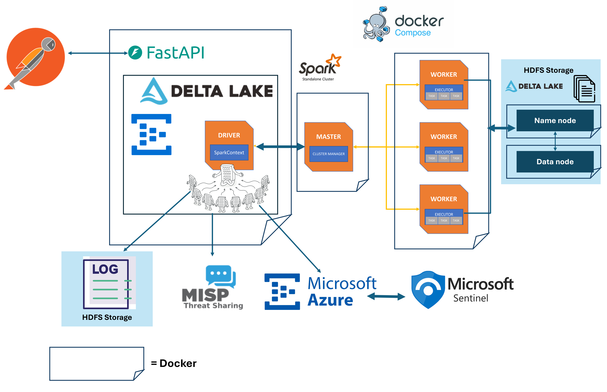

# Documentation of Cyberfuse Project

## Project Architecture



## Project Description

This project is a FastAPI application integrated with Apache Spark, MISP (Malware Information Sharing Platform), and Microsoft Sentinel. It provides a unified platform for ingesting and processing security data from various sources. The application leverages Spark for large-scale data processing and Delta Lake for efficient data storage and management. It also integrates with Azure Event Hub to stream data from Microsoft Sentinel, enabling real-time security analytics and threat intelligence.

## Docker Compose

The project uses Docker Compose to set up and manage the following services:

- **spark-master**: The Spark master node that manages the cluster resources and schedules the execution of applications.
- **spark-worker**: The Spark worker nodes that execute tasks assigned by the master.
- **fastapi**: The FastAPI application that provides the API endpoints for interacting with the Spark cluster and other services.
- **hadoop-namenode**: The Hadoop NameNode service that manages the HDFS namespace and regulates access to files by clients.
- **hadoop-datanode**: The Hadoop DataNode service that stores the actual data in HDFS.

### Key Configuration Points

- **Ports**: Each service exposes specific ports to allow communication and access. For example, the FastAPI application exposes ports 8000 and 4040, while the Hadoop NameNode exposes port 9870.
- **Dependencies**: Services are configured to depend on each other to ensure they start in the correct order. For example, the FastAPI service depends on the Spark master and worker nodes.
- **Volumes**: Local directories are mounted into the containers to persist data and share configuration files. For example, the local `app` directory is mounted into the FastAPI container.
- **Networks**: All services are connected to a custom Docker network to enable communication between them.

## Table of Contents
1. [Overviews](#overview)
2. [Setup Instructions](#setup-instructions)
3. [Environment Variables](#environment-variables)
4. [Configuration Files](#configuration-files)
5. [Docker Setup](#docker-setup)
6. [API Endpoints](#api-endpoints)
7. [Services](#services)
8. [Spark monitoring](#spark-monitoring)

## Overview 
### Spark
Apache Spark is a unified analytics engine for large-scale data processing. It provides high-level APIs in Java, Scala, Python, and R, and an optimized engine that supports general execution graphs. Spark is known for its speed, ease of use, and sophisticated analytics.

### Spark Components
1. **Spark Master**: The master node in a Spark cluster that manages the cluster resources and schedules the execution of applications.
2. **Spark Worker**: The worker nodes in a Spark cluster that execute tasks assigned by the master.
3. **Spark Driver**: The process that runs the main() function of the application and creates the SparkContext.
4. **Spark Executor**: The distributed agents responsible for executing tasks on the worker nodes.
### Spark sangleton Class
create a single SparkSession instance that can be used across your entire application, you can follow these steps:
- **Create a Singleton Class for SparkSession:** This ensures that only one instance of SparkSession is created and shared across the application.
- **Use the Singleton Class in Your Modules:** Import and use the singleton instance wherever needed.
### MISP
This project is a FastAPI application integrated with PySpark and MISP (Malware Information Sharing Platform). It provides endpoints to interact with MISP data and Spark cluster information.

### Syslog
Syslog is a standard protocol used to send system log or event messages to a specific server, called a syslog server. It is primarily used for computer system management and security auditing. In this project, syslog data is ingested, processed, and stored in Delta tables using Spark.

### Microsoft Sentinel with Event Hub
Microsoft Sentinel is a scalable, cloud-native, security information event management (SIEM) and security orchestration automated response (SOAR) solution. It delivers intelligent security analytics and threat intelligence across the enterprise. In this project, Microsoft Sentinel data is ingested through Azure Event Hub, processed using Spark, and stored in Delta tables for further analysis.


## Setup Instructions

### Prerequisites
- Docker
- Docker Compose

### Installation
1. Clone the repository:
    ```sh
    git clone https://github.com/AbdelErrahmane/cyberfuse.git
    cd cyberfuse
    ```

2. Create a `.env` file in the root directory (it s already created)


3. Build and run the Docker containers:
    ```sh
    docker-compose up --build
    ```

### Environment Variables
- **MISP_URL**: The URL of the MISP instance.
- **MISP_AUTHKEY**: The authentication key for the MISP instance.
- **AZURE_STORAGE_ACCOUNT_NAME:** The name of the Azure Storage account.
- **AZURE_STORAGE_ACCOUNT_ACCESS_KEY:** The access key for the Azure Storage account.
- **EVENTHUB_CONNECTION_STRING:** The connection string for the Azure Event Hub.
- **EVENTHUB_CONSUMER_GROUP:** The consumer group for the Azure Event Hub.

### Configuration Files

#### `requirements.txt`
Lists the Python dependencies for the project:
```plaintext
fastapi>=0.95.0
uvicorn>=0.22.0
pyspark==3.5.2
requests
urllib3
python-dotenv
delta-spark==3.2.0
```


#### `master.env`
Configuration for the Spark master:

```properties
SPARK_MODE=master
SPARK_MASTER_HOST=spark-master
SPARK_MASTER_PORT=7077
SPARK_MASTER_WEBUI_PORT=8080
# New configuration settings
SPARK_CONF_spark_serializer=org.apache.spark.serializer.KryoSerializer
SPARK_CONF_spark_kryoserializer_buffer_max=2000m
SPARK_CONF_spark_driver_maxResultSize=2g
SPARK_CONF_spark_rpc_message_maxSize=2000
SPARK_CONF_spark_task_maxFailures=10
SPARK_CONF_spark_executor_memory=4g
SPARK_CONF_spark_driver_memory=6g
# HDFS Configuration
SPARK_CONF_spark_hadoop_fs_defaultFS=hdfs://hadoop-namenode:8020
CLUSTER_NAME=cyberfuse-hadoop-cluster

```

#### `worker.env`
Configuration for the Spark worker:
```properties
SPARK_MODE=worker
SPARK_MASTER=spark://spark-master:7077
SPARK_WORKER_CORES=3
SPARK_WORKER_MEMORY=3G
SPARK_WORKER_PORT=7078
SPARK_WORKER_WEBUI_PORT=8081
# New configuration settings
SPARK_CONF_spark_serializer=org.apache.spark.serializer.KryoSerializer
SPARK_CONF_spark_kryoserializer_buffer_max=2000m
SPARK_CONF_spark_driver_maxResultSize=2g
SPARK_CONF_spark_rpc_message_maxSize=2000
SPARK_CONF_spark_task_maxFailures=10
SPARK_CONF_spark_executor_memory=4g
SPARK_CONF_spark_driver_memory=6g
# cluser Node
CLUSTER_NAME=cyberfuse-hadoop-cluster

```

By using Docker Compose, you can easily manage and scale the services required for your application. The configuration ensures that all components work together seamlessly, providing a robust environment for data processing and analysis.
## Docker Setup
The project uses Docker Compose to set up the following services:
- **spark-master**: The Spark master node.
- **spark-worker**: The Spark worker node.
- **fastapi**: The FastAPI application.
- **namenode**: The namenode of HDFS.
- **datanode**: The datanode of HDFS.

### Docker Compose Configuration
The `docker-compose.yml` file defines the services and their configurations.

### Dockerfile
The `Dockerfile` sets up the FastAPI application environment.
### put the syslog files in HDFS

Create a /shared folder and run /setup_hdfs.sh to put the data to HDFS:

```sh
#!/bin/bash

# Create the /data directory in HDFS
docker exec -it hadoop-datanode hdfs dfs -mkdir -p /data
docker exec -it hadoop-datanode hdfs dfs -mkdir -p /delta/syslog
echo "Folder created in HDFS"
sleep 5
echo "------------------- Puting files in HDFS started -------------------"
# Copy files from /shared to /data in HDFS
docker exec -it hadoop-datanode hdfs dfs -put /shared/* /data/
echo "------------------- Puting files in HDFS finished -------------------"
```

## API Endpoints

### Spark Router
- **GET /spark/status**: Returns the status of the Spark cluster.

### MISP Router
- **GET /misp/status**: Checks the connection to the MISP instance.
- **GET /misp/feeds**: Fetches and processes MISP feeds and write feeds dataframe in DeltaLake in HDFS.
- **GET /misp/feeds/read**: Reads the MISP feeds Delta table.
- **GET /misp/events/view/{event_id}**: Fetches and processes a specific MISP event by ID and write the different pyspark dataframes: event_details; org_details; orgc_details; and attributes in DeltaLake in HDFS.

### Sentinel Router
- **POST /sentinel/startstream/{timestamp}**: Starts the Event Hub stream for a specified duration and write the different sentinel dataframes in DeltaLake in HDFS.
- **GET /sentinel/read/{deltatable}**: Reads a specified Delta table from the Sentinel data from HDFS.

### Syslog Router
- **GET /syslog/status**: Checks the connection to Spark and HDFS.
- **GET /syslog/write/{path_file}**: Get data from the saved folder putting in HDFS from shared , read them in pyspark dataframe and writes syslog data to a Delta table.
- **GET /syslog/read/{deltatable}**: Reads a specified Delta table from the syslog data saved in HDFS.

### SQL Router
- **GET /sql/query**: Runs a SQL query on the Spark cluster to read the data from DeltaLake saved in HDFS.
- **GET /query/sentinel/pagination/**: Runs a paginated SQL query on the Spark cluster.
## Services

### Spark Service
- **get_spark_info**: Retrieves information about the Spark cluster.

### MISP Service
- **check_misp_connexion**: Checks the connection to the MISP instance.
- **get_json_session**: Retrieves JSON data from the MISP instance Deployed in Azure.
- **process_feeds**: Processes MISP feeds into a PySpark DataFrame and Save them or merge them in Deltable saved in HDFS.
- **process_events**: Processes MISP events into a PySpark DataFrame and Save them or merge them in Deltable saved in HDFS.

### Sentinel Service
- **start_eventhub_stream**: Starts the Event Hub stream for a specified duration and processes the data.

### Syslog Service
- **write_spark_syslog**: Writes syslog data to a Delta table.
- **read_spark_syslog**: Reads a specified Delta table from the syslog data.

### Delta Table Service
- **clean_column_names**: Cleans column names by replacing spaces and special characters with underscores.
- **write_spark_delta**: Writes a DataFrame to a Delta table in HDFS.
- **read_spark_delta**: Reads a Delta table from HDFS.
- **save_or_merge_delta_table**: Saves or merges data into a Delta table in HDFS.
## core package

### Spark Singleton
The `SparkSingleton` class ensures that only one instance of `SparkSession` is created and shared across the application. This is useful for managing resources efficiently and avoiding multiple Spark contexts.

### MISP Session
The `get_misp_session` function sets up a session with the MISP instance using the provided URL and authentication key. It returns a session object that can be used for subsequent API requests.

### HDFS Session
The `check_spark_hdfs_connection` function checks the connection to HDFS by attempting to read a CSV file from HDFS using Spark. It returns the status of the connection and the number of rows read from the file.

### Sentinel Session
The `start_eventhub_stream` function starts the Event Hub stream for a specified duration and processes the data.

## Spark monitoring

The monitore the executions of the different containers of the application

### Spark
- **The execution of spark Jobs, and all execution in spark port:** 4040
- **Spark master port:** 8080
- **Spark workers port:** 8081
### HDFS
- **HDFS port:** 9864


## DeltaLake path in HDFS

- **SYSLOG** : /delta/syslog

- **MISP attributes** : /delta/misp/attributes
- **MISP events** : /delta/misp/events
- **MISP feeds** : /delta/misp/feeds
- **MISP orgcs** : /delta/misp/orgcs
- **MISP orgs** : /delta/misp/orgs
- **Sentinel** /delta/sentinel/{name_of_table as folder}
